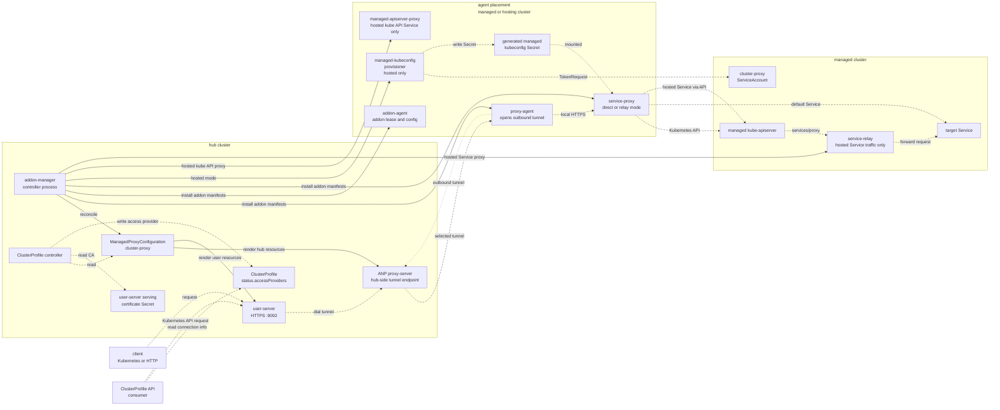
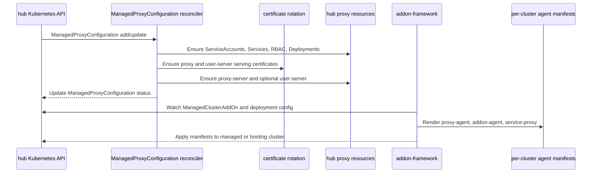
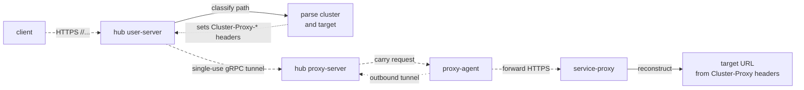
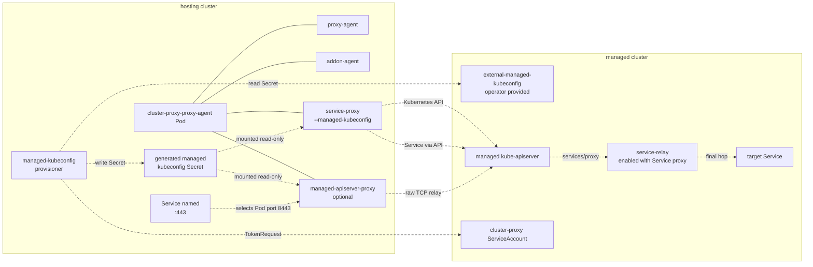
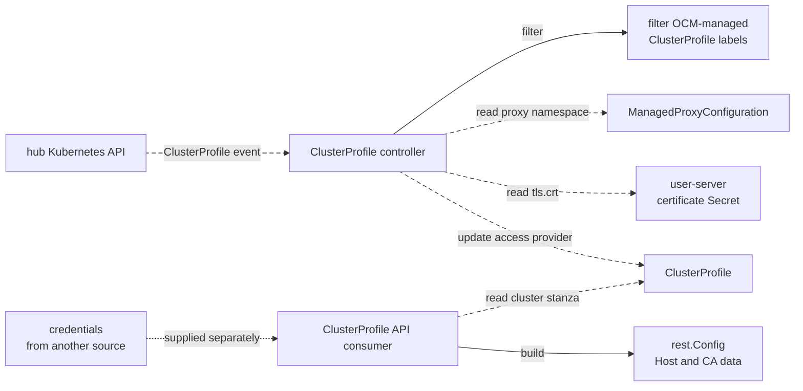
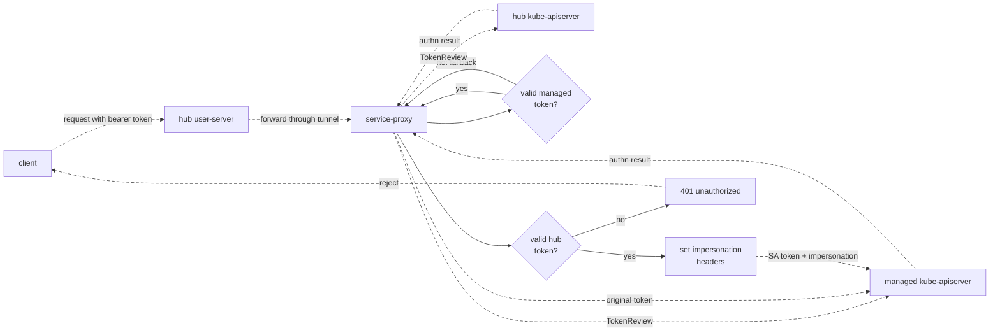
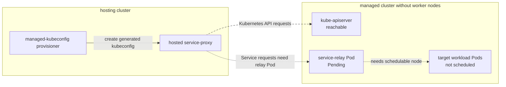

<!-- markdownlint-disable MD013 -->

# Cluster Proxy Architecture

Cluster Proxy provides a hub-side entry point for reaching Kubernetes APIs and
Services in Open Cluster Management (OCM) managed clusters. The important design
constraint is network direction: a managed cluster may be behind NAT, a
firewall, or a private network, so Cluster Proxy does not require inbound
connectivity to the managed cluster. Instead, the agent side opens outbound
connections to the hub side and client traffic is carried back through those
tunnels.

This document describes the deployed components, the request paths they handle,
the hosted-mode differences, and the `ClusterProfile` integration used by
Cluster Inventory API consumers.

## Terms

- `hub cluster`: The OCM control plane cluster. It runs addon management,
  `proxy-server`, and optionally `user-server`.
- `managed cluster`: The cluster whose Kubernetes API or Services are reached
  through Cluster Proxy.
- `hosting cluster`: In addon-framework hosted mode, the cluster where addon
  agent Pods run on behalf of a managed cluster.
- `Kubernetes API request`: A request whose final target is the managed cluster
  kube-apiserver.
- `Service request`: A request whose final target is a normal Service inside
  the managed cluster.

## Mermaid Line Rules

The flowcharts use the same edge rules throughout:

- `trafficEdge` shows live request traffic and is animated.
- `tunnelEdge` shows long-lived tunnel setup and is animated with a dotted
  style.
- Static solid edges show reconcile, create, update, render, apply, or
  provision actions.
- Static dotted edges show local mount, config, dependency, or authz
  relationships where no request is being sent.

## Component Model



The `proxy-agent`, `addon-agent`, and `service-proxy` containers are colocated in
the `cluster-proxy-proxy-agent` Deployment. In default mode that Deployment runs
on the managed cluster. In hosted mode it runs on the hosting cluster and mounts
a generated managed-cluster kubeconfig.

## Control Plane Reconciliation

`ManagedProxyConfiguration` is the hub-side source of truth for the proxy
deployment. The addon manager reconciles hub resources from it and uses the
addon-framework to render per-cluster agent manifests.



The proxy-server entry point controls how agents reach the hub-side tunnel
endpoint:

- `Hostname`: Agents connect to the configured hostname and port.
- `LoadBalancerService`: Agents connect to the first ingress address of the
  configured LoadBalancer Service.
- `PortForward`: Agents connect to `127.0.0.1`; the addon-agent provides the
  local port-forward proxy to the hub proxy-server.

## Request Shapes

`user-server` exposes one HTTPS entry point and classifies requests by path.

- Kubernetes API requests use paths such as `/<cluster>/api/...` or
  `/<cluster>/apis/...`. Any non-Service path is treated as a request for the
  managed cluster kube-apiserver.
- Service requests use the Kubernetes Service proxy shape with `proxy-service`
  as the marker:

  ```text
  /<cluster>/api/v1/namespaces/<ns>/services/<scheme>:<service>:<port>/proxy-service/<path>
  ```

For both request types, `user-server` parses the managed cluster name and writes
the resolved target into `Cluster-Proxy-*` headers before forwarding the request
through the apiserver-network-proxy tunnel.



## Default Mode

In default mode the agent Deployment runs on the managed cluster. Because
`service-proxy` is inside the managed cluster network, it can use cluster-local
DNS and Service IPs.

```mermaid
flowchart LR
    Client["client<br/>on or near hub"]
    UserServer["hub user-server"]
    ProxyServer["hub proxy-server"]
    ProxyAgent["managed proxy-agent"]
    ServiceProxy["managed service-proxy"]
    ManagedAPI["managed kube-apiserver<br/>kubernetes.default.svc"]
    Service["managed Service<br/><service>.<namespace>.svc"]

    ProxyAgent tunnelAgentProxy@-.->|"outbound tunnel"| ProxyServer
    Client trafficClientUser@-->|"/<cluster>/..."| UserServer
    UserServer trafficUserProxy@-->|"dial through ANP"| ProxyServer
    ProxyServer trafficProxyAgent@-->|"carry request"| ProxyAgent
    ProxyAgent trafficAgentService@-->|"HTTPS"| ServiceProxy
    ServiceProxy trafficServiceAPI@-->|"Kubernetes API"| ManagedAPI
    ServiceProxy trafficServiceTarget@-->|"Service request"| Service

    classDef trafficEdge stroke-dasharray: 6 4, stroke-dashoffset: 24, animation: dash 1s linear infinite;
    classDef tunnelEdge stroke-dasharray: 2 6, stroke-dashoffset: 24, animation: dash 1.5s linear infinite;
    class trafficClientUser,trafficUserProxy,trafficProxyAgent,trafficAgentService,trafficServiceAPI,trafficServiceTarget trafficEdge;
    class tunnelAgentProxy tunnelEdge;
```



Default mode has no managed-cluster relay component. The final hop is a normal
in-cluster request from `service-proxy` to either `kubernetes.default.svc` or a
target Service DNS name.

## Hosted Mode

In hosted mode the agent Deployment runs on the hosting cluster instead of the
managed cluster. The hosted `service-proxy` cannot resolve managed-cluster
Service DNS names directly, so kube-apiserver traffic and regular Service
traffic use different final hops.



The external managed kubeconfig is used only by the provisioner. The provisioner
uses it to request short-lived tokens for the managed cluster
`cluster-proxy` ServiceAccount, writes a generated kubeconfig Secret in the
hosting addon namespace, and reports `ManagedKubeconfigReady` on the hub
`ManagedClusterAddOn`.

### Hosted Kubernetes API Requests

Kubernetes API requests through `user-server` do not require a managed-cluster
workload Pod. The hosted `service-proxy` reads the generated kubeconfig and
connects to the managed kube-apiserver endpoint from that kubeconfig.

```mermaid
flowchart LR
    Client["client"]
    UserServer["hub user-server"]
    ProxyServer["hub proxy-server"]
    ProxyAgent["hosting proxy-agent"]
    ServiceProxy["hosting service-proxy"]
    ManagedAPI["managed kube-apiserver"]

    ProxyAgent tunnelAgentProxy@-.->|"outbound tunnel"| ProxyServer
    Client trafficClientUser@-->|"/<cluster>/api..."| UserServer
    UserServer trafficUserProxy@-->|"dial through ANP"| ProxyServer
    ProxyServer trafficProxyAgent@-->|"carry request"| ProxyAgent
    ProxyAgent trafficAgentService@-->|"HTTPS"| ServiceProxy
    ServiceProxy trafficServiceAPI@-->|"generated kubeconfig"| ManagedAPI

    classDef trafficEdge stroke-dasharray: 6 4, stroke-dashoffset: 24, animation: dash 1s linear infinite;
    classDef tunnelEdge stroke-dasharray: 2 6, stroke-dashoffset: 24, animation: dash 1.5s linear infinite;
    class trafficClientUser,trafficUserProxy,trafficProxyAgent,trafficAgentService,trafficServiceAPI trafficEdge;
    class tunnelAgentProxy tunnelEdge;
```



The separate `managed-apiserver-proxy` container is used for the optional
`enableKubeApiProxy` Service named after the cluster. In hosted mode that
Service selects the agent Pod and forwards port `443` to `managed-apiserver-proxy`
port `8443`, which relays raw TCP to the managed kube-apiserver. This is distinct
from the `user-server` path shown above.

### Hosted Service Requests

Regular Service requests need a managed-cluster receiver because the hosted
`service-proxy` cannot use managed-cluster Service DNS or ClusterIPs directly.
When `enableServiceProxy=true` in hosted mode, Cluster Proxy deploys
`service-relay` on the managed cluster.

```mermaid
flowchart LR
    Client["client"]
    UserServer["hub user-server"]
    ProxyServer["hub proxy-server"]
    ProxyAgent["hosting proxy-agent"]
    ServiceProxy["hosting service-proxy"]
    HeaderState["stores original<br/>Authorization"]
    ManagedAPI["managed kube-apiserver"]
    ServiceRelay["managed service-relay"]
    RelayAuth["TokenReview and<br/>restore Authorization"]
    Service["managed Service"]

    ProxyAgent tunnelAgentProxy@-.->|"outbound tunnel"| ProxyServer
    Client trafficClientUser@-->|"/proxy-service/..."| UserServer
    UserServer trafficUserProxy@-->|"dial through ANP"| ProxyServer
    ProxyServer trafficProxyAgent@-->|"carry request"| ProxyAgent
    ProxyAgent trafficAgentService@-->|"HTTPS"| ServiceProxy
    ServiceProxy -->|"prepare relay headers"| HeaderState
    ServiceProxy trafficServiceAPI@-->|"services/proxy call"| ManagedAPI
    ManagedAPI trafficAPIRelay@-->|"forward to relay"| ServiceRelay
    ServiceRelay -->|"authenticate caller"| RelayAuth
    ServiceRelay trafficRelayTarget@-->|"forward request"| Service

    classDef trafficEdge stroke-dasharray: 6 4, stroke-dashoffset: 24, animation: dash 1s linear infinite;
    classDef tunnelEdge stroke-dasharray: 2 6, stroke-dashoffset: 24, animation: dash 1.5s linear infinite;
    class trafficClientUser,trafficUserProxy,trafficProxyAgent,trafficAgentService,trafficServiceAPI,trafficAPIRelay,trafficRelayTarget trafficEdge;
    class tunnelAgentProxy tunnelEdge;
```



The relay exists only for hosted regular Service traffic. It is not used for
default mode and is not needed for hosted Kubernetes API requests.

## ClusterProfile Integration

When the `ClusterProfile` feature gate is enabled, Cluster Proxy watches OCM
managed `ClusterProfile` resources and appends an access provider named
`open-cluster-management`.

The reconciler only targets `ClusterProfile` resources that have:

- `x-k8s.io/cluster-manager=open-cluster-management`, which ensures OCM is the
  cluster manager owner.
- `open-cluster-management.io/cluster-name=<cluster>`, which gives the managed
  cluster identity expected by OCM.



The access provider written by Cluster Proxy has this shape:

```yaml
status:
  accessProviders:
  - name: open-cluster-management
    cluster:
      server: https://cluster-proxy-addon-user.<namespace>:9092/<cluster>
      certificate-authority-data: <user-server-serving-certificate>
      extensions:
      - name: client.authentication.k8s.io/exec
        extension:
          clusterName: <cluster>
```

`ClusterProfile.status.accessProviders[].cluster.server` is connection
information, equivalent to the `clusters[].cluster.server` field in a kubeconfig
or `rest.Config.Host` in client-go. It intentionally does not contain tokens,
client certificates, or other user credentials.

For the access provider to be usable by in-cluster consumers, the chart must
also deploy the request path it advertises:

- `featureGates.clusterProfile=true` enables the `ClusterProfile` controller.
- `userServer.enabled=true` deploys `cluster-proxy-addon-user` and rotates its
  serving certificate.
- `enableServiceProxy=true` deploys `service-proxy`, the target behind
  `user-server`.

The advertised server URL is hub-cluster internal Service DNS by default. A
consumer running outside the hub cluster needs an externally reachable
`user-server` endpoint and a serving certificate with suitable SANs.

## Authentication And Trust Boundaries

`user-server` terminates TLS for the public Cluster Proxy endpoint and preserves
the caller's request headers when forwarding through the tunnel. The managed
cluster remains the authorization point for proxied Kubernetes API operations.



In hosted Service relay mode there is an additional trust boundary. The hosted
`service-proxy` calls the managed kube-apiserver `services/proxy` subresource
using the generated managed kubeconfig token. The managed kube-apiserver
authenticates and authorizes that subresource call before forwarding to
`service-relay`. The relay then re-authenticates the caller token with
TokenReview and only trusts configured caller usernames, normally the managed
cluster `system:serviceaccount:<addon-namespace>:cluster-proxy` identity.

Operators should still restrict network access to the relay with a
cluster-appropriate NetworkPolicy. The relay binary fails closed if no trusted
caller username is configured.

## Hosted Managed Clusters Without Worker Nodes

A hosted managed cluster can have a healthy kube-apiserver before it has any
schedulable workload nodes. Cluster Proxy treats that as a valid intermediate
state.



Expected behavior in this state:

1. `ManagedKubeconfigReady=True` can be reported once the generated kubeconfig
   Secret exists.
2. Kubernetes API proxy requests can work because they target the managed
   kube-apiserver directly from the hosted `service-proxy`.
3. `service-relay` and target Service backends can remain unavailable until
   workload Pods can run.
4. Regular Service proxy requests are not expected to succeed until the relay
   Pod and target Service backends are Ready.

## Deployment Invariants

These invariants keep the request path predictable:

1. Managed or hosting-side agents establish outbound tunnels to the hub
   `proxy-server`; the managed cluster does not need inbound access from the hub.
2. `user-server` and `service-proxy` are the HTTP request path used by
   `ClusterProfile.status.accessProviders`.
3. `ClusterProfile` access providers contain server and CA data only; caller
   credentials must come from a separate mechanism.
4. Default mode keeps `service-proxy` in the managed cluster and performs the
   final hop with managed-cluster DNS.
5. Hosted mode keeps `service-proxy` in the hosting cluster and uses a generated
   managed kubeconfig for managed kube-apiserver access.
6. Hosted regular Service traffic requires a matching managed-cluster
   `service-relay` name and port; kube-apiserver traffic does not.
7. The external hosted-mode kubeconfig is an input to the provisioner only. The
   steady-state agent containers mount the generated short-lived kubeconfig.
8. `managed-apiserver-proxy` serves the optional cluster-named Service for kube
   API proxying in hosted mode; it is separate from the `user-server` access
   provider path.
